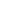
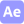
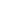

## Olá seja bem-vindo(a)!

  Me chamo <strong>Ramir Junior</strong>, sou apaixonado pelo mundo mobile. 
    Desejo seguir carreira de desenvolvimento e me tornar um especialista na área. 
<strong>Vamos de café pra esse papo?</strong> 

 

  💼 Habilidades: <strong>Kotlin, Android Studio, Firebase Realtime, Constraint Layouts, RecyclerView, Retrofit, Git/Github/Bitbucket.</strong>

  🚀  Estudando: <strong>Compose Jetpack</strong>

<h3 align="center">Você pode me encontrar em</h3>

    
    
    
    
      
    <h3 align="center">Tecnologias</h3>
    
    
    
    
    
        
    
    
       
    
    
    
        
    
    
    
    
     

<h3 align="center">⭐ GitHub Stats</h3>

    
    

 
<h3>Saiba mais</h3> 

## Educação

- 📖 **Sistemas de Informação**

  📆 Formação 2023

  📍 **PUC Minas São Gabriel** - Belo Horizonte, Minas Gerais, Brasil

## Idiomas

- :us: Inglês

  :arrow_upper_right: Intermediário

   

- :es: Espanhol

  :arrow_upper_right: Intermediário
  
  

